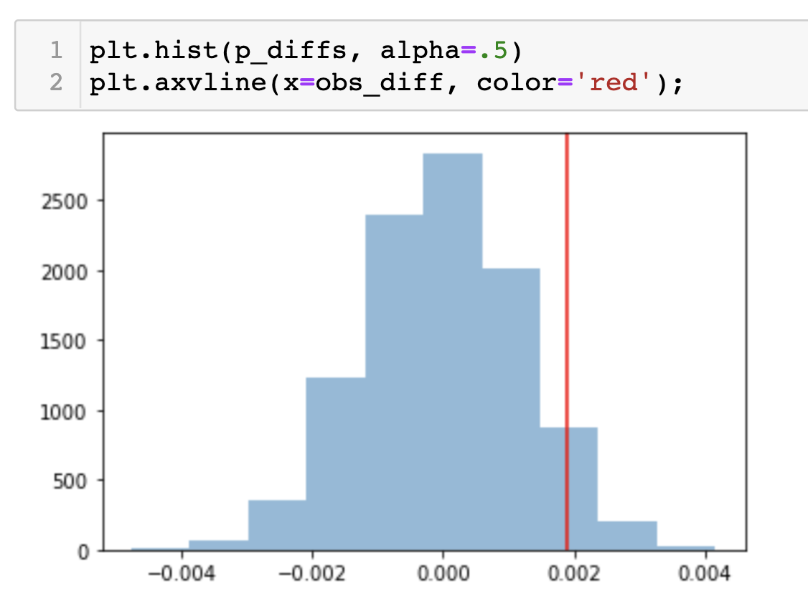
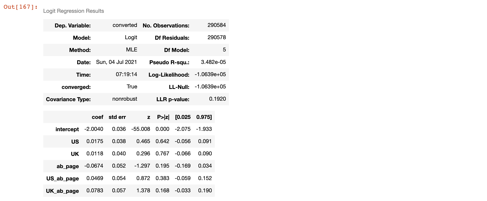

# Analyze A/B Test Results
Third Project for my Data Analysis Nanodegree, Udacity 

Photo by <a href="https://unsplash.com/@rupixen?utm_source=unsplash&utm_medium=referral&utm_content=creditCopyText">rupixen.com</a> on <a href="https://unsplash.com/s/photos/e-commerce?utm_source=unsplash&utm_medium=referral&utm_content=creditCopyText">Unsplash</a>

Interpretation of the results of an A/B test run by an e-commerce website. My goal is to work through this notebook to help the company understand if they should implement the new page, keep the old page, or perhaps run the experiment longer to make their decision. 

### Table of Contents
- Part I - Probability
- Part II - A/B Test
- Part III - Regression
- Conclusion
- Sources

### Tools
Python | pandas | numpy | matplotlib  
Jupyter Notebook

### Introduction
**For this project, I  understand the results of an A/B test run by an e-commerce website. Your goal is to work through this notebook to help the company understand if they should implement the new page, keep the old page, or perhaps run the experiment longer to make their decision.**

### Part I - Probability
**e. Explain whether you think there is sufficient evidence to conclude that the new treatment page leads to more conversions.**
- A direct comparison of proportions of site conversions shows an extremely low difference (0.15%) in favor of the old control page on the new treatment page. Therefore, this result does not show sufficient evidence for more conversions by using the new treatment page.
- A deep analysis is recommended to support wiser decision-making.

### Part II - A/B Test

**k. What you just computed in part j. What is this value called in scientific studies? What does this value mean in terms of whether or not there is a difference between the new and old pages?**
- This is the p-value.
- With a p-value superior to a type I error rate of 0.05, we have no evidences that the new pages exceeds the old ones in conversions.Therefore, we fail in reject the null hypothesis.
**n. What do the z-score and p-value you computed in the previous question mean for the conversion rates of the old and new pages? Do they agree with the findings in parts j. and k.?**
- The z-score is inside our critical value and the p-value is still large.
This means that the z-score and p-value agree with the findings in parts j and k, that is, there is no signifficant difference in the conversions of each landing page, and we cannot reject the null hypothesis.

## Part III - A regression approach
**e. What is the p-value associated with ab_page? Why does it differ from the value you found in Part II?**
- The p-value associated with ab_page is 0.19.
- The test in partII is made in one direction (one-tail test) to try to prove that the alternative hypothesis is true (if the new site has more conversions than the old one).
The test in partIII is made in both sides (two-tail test) with a binary categorical dependent variable (conversion or no conversion). Here, the test check if the independent variable (ab_page/new_page) had any effect at all.

**f. Now, considering other things that might influence whether or not an individual converts. Discuss why it is a good idea to consider other factors to add into your regression model. Are there any disadvantages to adding additional terms into your regression model?**

- Aversion to changes can influence user behavior of some people (Simpson's Paradox). Therefore, time (tests duration) is an important variable in tests regression.

- A problem of adding many variables to the model can happen when two or more variables are correlated, when one interfere in another. This situation can cause misunderstanting and bias in testing and interpreting tests.

### Conclusions

- The p-values were demonstrated to be higher than alpha in "Part II" and "Part III" tests, with different methodologies. So, we fail to reject the null hypothesis in both cases.
- Results show no significance in conversions by launching a new page, that suggests the company should keep with the old one.
- Comparing page conversion from different countries, our tests also don't show a significant difference in statistics. It suggests that the variable country does not interfere much in the conversion.
- However, I could suggest the company we run the tests longer, and consider the variable time to discard bias by Simpson's Paradox. Thus avoiding hasty conclusions and financial losses in not launching a new page that already has been developed and could maybe benefit the company.

### Sources
https://www.youtube.com/watch?v=NNpv-n_Hbvc 
https://stackoverflow.com/questions/29337603/scipy-two-tail-ppf-function-for-a-z-value 
https://www.statisticshowto.datasciencecentral.com/ 
https://machinelearningmastery.com/critical-values-for-statistical-hypothesis-testing/ 
http://lindsaymoir.com/wp-content/uploads/2018/05/Analyze_ab_test_results_notebook.html 
https://github.com/IamMohitM/Analyze-A-B-Test-Results/blob/master/Analyze_ab_test_results_notebook.ipynb 
Book: An Introduction to Statistical Learning. Gareth James, Daniela Witten, Trevor Hastie, Robert Tibshirani 
Udacity 
Documentations 

## License

The MIT License

